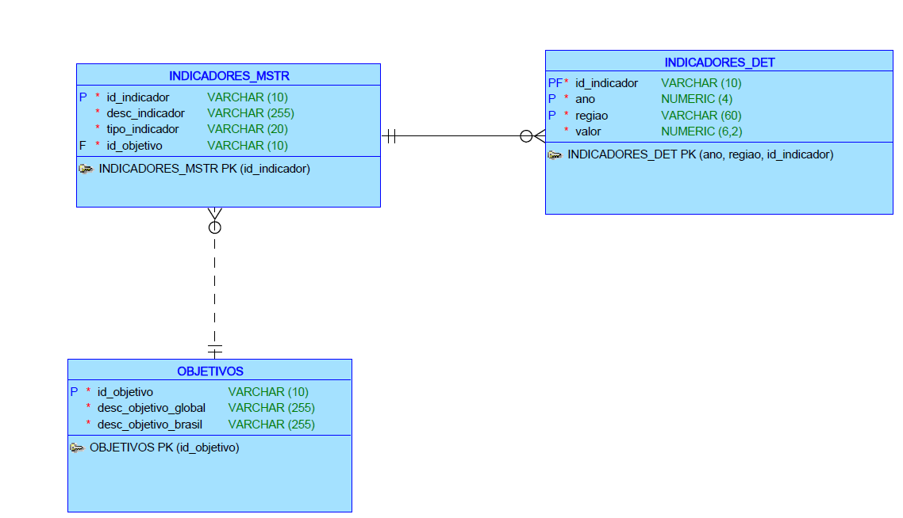
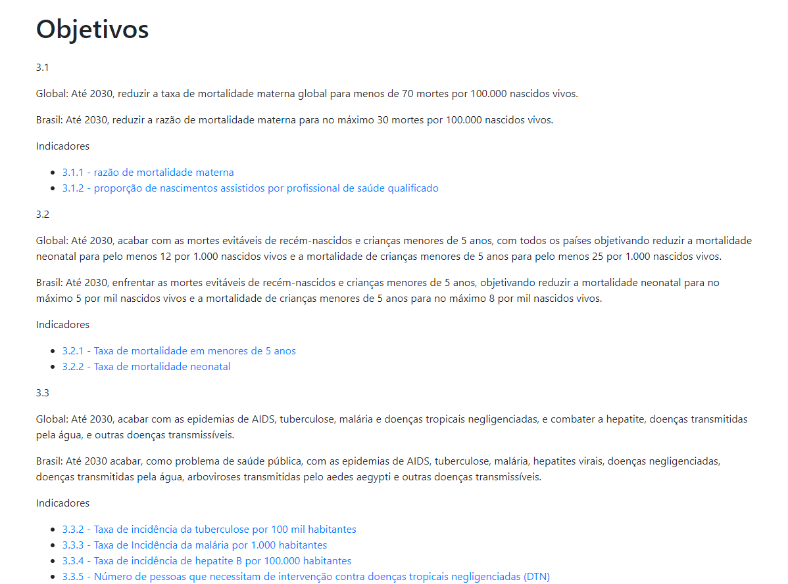
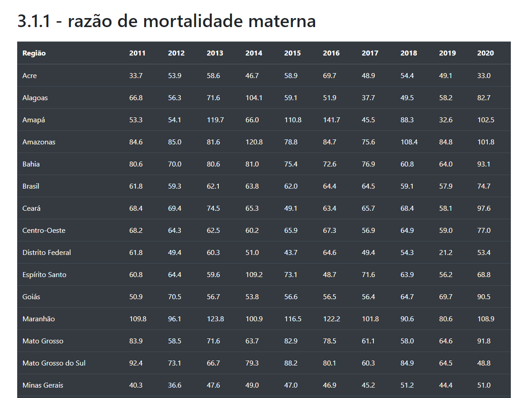
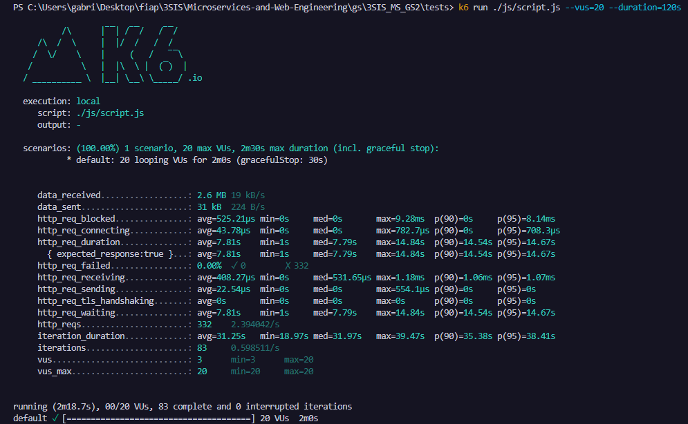

Dados

Os esquemas Lógico e Relacional do banco de dados podem ser encontrados na pasta
root do projeto (Logical.pdf, Relational.pdf)

Os scripts de DDL e carga de dados estão na pasta /backend/src/main/sql

Aplicação Backend

A aplicação Backend foi criada com Spring Boot e banco de dados Oracle
Endpoints REST
    /objetivos
    /indicador/{id}

Aplicação Frontend

A aplicação frontend foi criada com Thymeleaf e pode ser acessada nas URLS:

/ui/objetivos

/ui/indicador/{id}

Testes

O teste de carga pode ser executado utilizando os comandos:

    cd tests
    k6 run ./js/script.js --vus=10 --duration=60s

Resultados dos testes de carga:
83 iterações completas em 138.7s com 20 VUs simultâneos
Cada iteração conta com 4 requisições, o que são 332 requisições em 138.7 segundos

Build

1. Editar o arquivo /resources/application.properties com o seguinte template:

        server.port=8080
        # JPA
        spring.jpa.generate-ddl=false
        spring.jpa.hibernate.ddl-auto=update
        spring.datasource.url=jdbc:oracle:thin:@oracle.fiap.com.br:1521:orcl
        spring.datasource.driverClassName=oracle.jdbc.driver.OracleDriver
        spring.datasource.username=
        spring.datasource.password=
        spring.datasource.testWhileidle=true
        spring.datasource.validationQuery=select 1
        spring.datasource.maxActive=3

Por questões de segurança, o application.properties não está no repositório do GitHub. Entretanto o arquivo completo foi enviado pelo portal do aluno.

2. Se necessário, os scripts de DDL e carga de dados estão na pasta /backend/src/main/sql

3. Utilizar o comando mvnw package para gerar o arquivo .jar do projeto

4. Utilizar o comando docker build . --tag=gs-application no diretório raíz do projeto 

5. utilizar o comando docker run -p 8080:8080 gs-application

